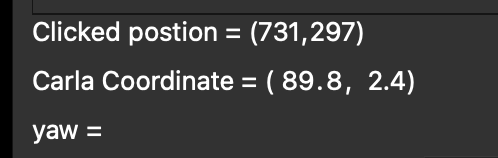
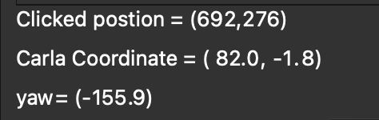
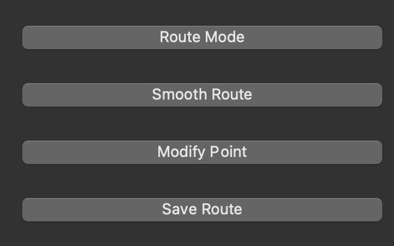

# Map_Visualiser


## Install the environment

```bash
conda create -n label python=3.7
conda activate label

# install package
conda  install pyqt
pip install opencv-python-headless
pip install scipy
pip install six
```
## Label Tags
1. Click 4 point on the image 
2. Right click to check the region
3. Input the tag name to "line edit"
4. Click the button "Save Region"
5. Click the button "Show Results" to see the image with tags

## How to get point in Carla Coordinate
1. Just click on the map, the infos will show on right hand side.

2. Click another point on the map, it will caculate the yaw (  previous point to current point )


## How to get route

1. Push "Route Mode Button"
2. Click points on the map 
3. Push "Smooth Point"
4. Push "save Route"


