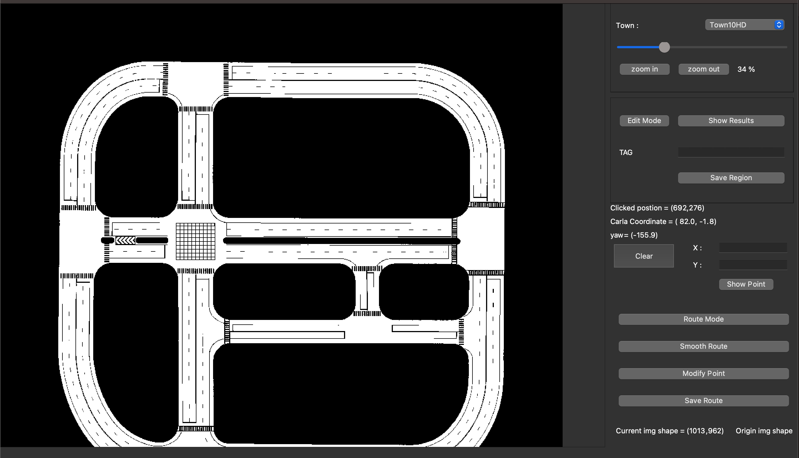

# Map_Visualiser
map Visualiser



## Install the environment

```bash
conda create -n label python=3.7
conda activate label

# install package
conda  install pyqt
pip install opencv-python-headless
pip install scipy
```
## Label Tags
1. Click 4 point on the image 
2. Right click to check the region
3. Input the tag name to "line edit"
4. Click the button "Save Region"
5. Click the button "Show Results" to see the image with tags
